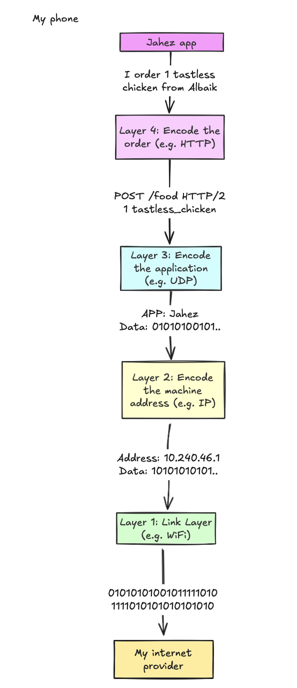

# What would happen if we didn't use TCP or UDP? 
Switches, bridges, routers, load balancers, firewalls—these network boxes keep the internet running. Routing, blocking, mirroring, duplicating and deduplicating traffic in ways most people never think about. Without them, this document wouldn’t have reached you

But the network is just one layer. The OS has its own way of handling packets—classifying, queuing, enforcing firewall rules, translating addresses, deciding what gets through and what gets dropped without a trace. Every part plays by its own rules, shaping what’s “allowed” and what's not

At some point, I wondered—*what if I sent a packet using a transport protocol that didn’t exist?* Not TCP, not UDP, not even ICMP—something completely made up. Would the OS let it through? Would it get stopped before it even left my machine? Would routers ignore it, or would some middlebox kill it on sight? Could it actually move faster by slipping past common firewall rules?

No idea.

So I had to try.

First, I sent the packets to myself, just to see how my own machine handled the poison I made up. Then, I sent them across continents to a remote Linux server to see if they’d actually make it.
# Some background first
> [!NOTE]
> Feel free to skip this section if you already know how the internet works. Otherwise, continue reading on

But wait—what exactly is a transport layer protocol?

The internet isn’t magic. It just looks that way. Underneath, it’s a stack of protocols, each one shoving data to the next until it reaches its destination. At the application level, you send a request—loading a website, streaming a video, or whatever you do. That request gets wrapped by the OS in multiple layers of metadata, addresses, and headers, until it’s nothing but raw bits flying through the network

It kinda works like this:
<p align="center">   </p>
<p align="center"><sub>The diagram is 100% correct and should be included in all networking textbooks.</sub></p>

At the top, apps—browsers, games, whatever—generate requests (Load this page, Send this message, Connect to this game server). Then the requests start their descent through the network stack, getting wrapped, encoded, and addressed at each layer, until all that’s left is a stream of bits flying into the void

Each layer plays a role. IP assigns addresses and makes sure packets know where they’re going. The link layer handles the actual transmission—Wi-Fi, Ethernet, fiber optics, whatever. There’s more to it, but we’re not going down that rabbit hole right now. What matters is the layer that makes network communication actually usable

The **transport layer** is where networking personally starts to get interesting. It’s the first truly complex protocol layer. It doesn’t just move packets—it manages connections, makes sure multiple applications can share the same machine, and decides how data should flow.

This is where **TCP**, **UDP**, and their weird cousins live. The **IP Protocol** defines a field called `Protocol`. Setting this field to 6 means the encapsulated packet is TCP, 17 is UDP, and [there are others defined](https://en.wikipedia.org/wiki/List_of_IP_protocol_numbers) but some numbers are deliberately left out for future use

But what if we used those *unused* numbers?
# Experiment #1: Sending traffic.. to me!
First, I designed a [simple protocol](./hdp_specification.md): **HDP**. The specifics don’t matter—what matters is that it doesn’t resemble any known protocol. It’s an outsider, something the OS and network stack weren’t expecting

Next, I built a [server](./src/server/main.rs) and a [client](./src/client/main.rs). The client crafts an HDP packet (with an IP Protocol of 255) and hands it off to the OS, trusting it to deliver the data to itself. This sends the packet full circle, back to the OS, which (if all goes well) will recognize it, process it, and hand it off to the waiting server..! 

I opened two shells—one was the client:
```haskell
$ fortune | cowsay | sudo cargo run --bin client 127.0.0.1
```

And in another shell I opened the server
```haskell
$ sudo cargo run --bin server
```

Alright, let's send the packet via the client. 3, 2, 1, and.. the server got the message!
```haskell
$ sudo cargo run --bin server
~~~ IP Header ~~~
Version: 4
IHL: 5
DSCP: 0
ECN: 0
Total Length: 58625
Identification: 36455
Flags: 0
Fragment Offset: 0
TTL: 64
Protocol: 255
Header Checksum: 0
Source IP: [127, 0, 0, 1]
Destination IP: [127, 0, 0, 1]


~~~ HDP Header & Data ~~~
Source Port: 420
Destination Port: 420
Timestamp: 1739640243546134000
Data:  _________________________________________
/ Marriage is not merely sharing the      \
| fettucine, but sharing the burden of    |
| finding the fettucine restaurant in the |
| first place.                            |
|                                         |
\ -- Calvin Trillin                       /
 -----------------------------------------
        \   ^__^
         \  (oo)\_______
            (__)\       )\/\
                ||----w |
                ||     ||
```

Success! The OS accepted my protocol, looped it back, and delivered it to the server as if nothing was unusual. But before calling it a day, I had another question:

What would happen if we repeated this experiment, whilst changing the protocol number defined in the IP packet? 

My initial choice of **255** was arbitrary—it was an unused protocol number. But what if I tried something more… unconventional? I decided to test different protocol numbers, including:
- 6, the number assigned to **TCP** packets
- Or 2, which is the protocol number used for **ICMP** (i.e., the thing powering `ping`)
- Or even 256, an index beyond the defined boundaries of the IP Protocol
Would they make it? Would the OS freak out?

Let's see:
```haskell
fortune | cowsay | sudo cargo run --bin client 127.0.0.1 # This time looping over protocol numbers
```

**Results**:

| Protocol Number | Source IP (Server) | Byte Sum (Server) | Received (Server) | Succeeded (Client) | Byte sum (Client) | Failure reason (Client)                          | Time difference (μs) |
| --------------: | :----------------- | ----------------: | :---------------- | :----------------- | :---------------- | :----------------------------------------------- | -------------------: |
|               0 | 127.0.0.1          |               373 | 🫡                | 🫡                 | 373               | -                                                |                   70 |
|               1 | nan                |               nan | 🤯                | 🫡                 | 373               | -                                                |                  nan |
|               2 | nan                |               nan | 🤯                | 🫡                 | 373               | -                                                |                  nan |
|               3 | 127.0.0.1          |               373 | 🫡                | 🫡                 | 373               | -                                                |                   61 |
|               4 | 127.0.0.1          |               373 | 🫡                | 🫡                 | 373               | -                                                |                   52 |
|               5 | 127.0.0.1          |               373 | 🫡                | 🫡                 | 373               | -                                                |                   54 |
|               6 | nan                |               nan | 🤯                | 🫡                 | 373               | -                                                |                  nan |
|               7 | 127.0.0.1          |               373 | 🫡                | 🫡                 | 373               | -                                                |                   77 |
|               8 | 127.0.0.1          |               373 | 🫡                | 🫡                 | 373               | -                                                |                   63 |
|               9 | 127.0.0.1          |               373 | 🫡                | 🫡                 | 373               | -                                                |                   66 |
|              10 | 127.0.0.1          |               373 | 🫡                | 🫡                 | 373               | -                                                |                   52 |
|              11 | 127.0.0.1          |               373 | 🫡                | 🫡                 | 373               | -                                                |                   52 |
|              12 | 127.0.0.1          |               373 | 🫡                | 🫡                 | 373               | -                                                |                   63 |
|              13 | 127.0.0.1          |               373 | 🫡                | 🫡                 | 373               | -                                                |                   63 |
|              14 | 127.0.0.1          |               373 | 🫡                | 🫡                 | 373               | -                                                |                   50 |
|              15 | 127.0.0.1          |               373 | 🫡                | 🫡                 | 373               | -                                                |                   80 |
|              16 | 127.0.0.1          |               373 | 🫡                | 🫡                 | 373               | -                                                |                   64 |
|              17 | nan                |               nan | 🤯                | 🫡                 | 373               | -                                                |                  nan |
|              18 | 127.0.0.1          |               373 | 🫡                | 🫡                 | 373               | -                                                |                   42 |
|              19 | 127.0.0.1          |               373 | 🫡                | 🫡                 | 373               | -                                                |                   82 |
|              20 | 127.0.0.1          |               373 | 🫡                | 🫡                 | 373               | -                                                |                   71 |
|              21 | 127.0.0.1          |               373 | 🫡                | 🫡                 | 373               | -                                                |                   59 |
|              22 | 127.0.0.1          |               373 | 🫡                | 🫡                 | 373               | -                                                |                   50 |
|              23 | 127.0.0.1          |               373 | 🫡                | 🫡                 | 373               | -                                                |                   51 |
|              24 | 127.0.0.1          |               373 | 🫡                | 🫡                 | 373               | -                                                |                   54 |
|              25 | 127.0.0.1          |               373 | 🫡                | 🫡                 | 373               | -                                                |                   46 |
|              26 | 127.0.0.1          |               373 | 🫡                | 🫡                 | 373               | -                                                |                   48 |
|              27 | 127.0.0.1          |               373 | 🫡                | 🫡                 | 373               | -                                                |                   43 |
|              28 | 127.0.0.1          |               373 | 🫡                | 🫡                 | 373               | -                                                |                   46 |
|              29 | 127.0.0.1          |               373 | 🫡                | 🫡                 | 373               | -                                                |                   66 |
|              30 | 127.0.0.1          |               373 | 🫡                | 🫡                 | 373               | -                                                |                   56 |
|              31 | 127.0.0.1          |               373 | 🫡                | 🫡                 | 373               | -                                                |                   65 |
|              32 | 127.0.0.1          |               373 | 🫡                | 🫡                 | 373               | -                                                |                   56 |
|              33 | 127.0.0.1          |               373 | 🫡                | 🫡                 | 373               | -                                                |                   49 |
|              34 | 127.0.0.1          |               373 | 🫡                | 🫡                 | 373               | -                                                |                   47 |
|              35 | 127.0.0.1          |               373 | 🫡                | 🫡                 | 373               | -                                                |                   48 |
|              36 | 127.0.0.1          |               373 | 🫡                | 🫡                 | 373               | -                                                |                   59 |
|              37 | 127.0.0.1          |               373 | 🫡                | 🫡                 | 373               | -                                                |                   47 |
|              38 | 127.0.0.1          |               373 | 🫡                | 🫡                 | 373               | -                                                |                   45 |
|              39 | 127.0.0.1          |               373 | 🫡                | 🫡                 | 373               | -                                                |                   52 |
|              40 | 127.0.0.1          |               373 | 🫡                | 🫡                 | 373               | -                                                |                   57 |
|              41 | 127.0.0.1          |               373 | 🫡                | 🫡                 | 373               | -                                                |                   56 |
|              42 | 127.0.0.1          |               373 | 🫡                | 🫡                 | 373               | -                                                |                   51 |
|              43 | 127.0.0.1          |               373 | 🫡                | 🫡                 | 373               | -                                                |                   45 |
|              44 | 127.0.0.1          |               373 | 🫡                | 🫡                 | 373               | -                                                |                   58 |
|              45 | 127.0.0.1          |               373 | 🫡                | 🫡                 | 373               | -                                                |                   52 |
|              46 | 127.0.0.1          |               373 | 🫡                | 🫡                 | 373               | -                                                |                   50 |
|              47 | 127.0.0.1          |               373 | 🫡                | 🫡                 | 373               | -                                                |                   46 |
|              48 | 127.0.0.1          |               373 | 🫡                | 🫡                 | 373               | -                                                |                   51 |
|              49 | 127.0.0.1          |               373 | 🫡                | 🫡                 | 373               | -                                                |                   84 |
|              50 | nan                |               nan | 🤯                | 🤯                 | -                 | Operation not supported on socket (os error 102) |                  nan |
|              51 | nan                |               nan | 🤯                | 🤯                 | -                 | Operation not supported on socket (os error 102) |                  nan |
|              52 | 127.0.0.1          |               373 | 🫡                | 🫡                 | 373               | -                                                |                   92 |
|              53 | 127.0.0.1          |               373 | 🫡                | 🫡                 | 373               | -                                                |                  115 |
|              54 | 127.0.0.1          |               373 | 🫡                | 🫡                 | 373               | -                                                |                   81 |
|              55 | 127.0.0.1          |               373 | 🫡                | 🫡                 | 373               | -                                                |                   83 |
|              56 | 127.0.0.1          |               373 | 🫡                | 🫡                 | 373               | -                                                |                   96 |
|              57 | 127.0.0.1          |               373 | 🫡                | 🫡                 | 373               | -                                                |                   71 |
|              58 | 127.0.0.1          |               373 | 🫡                | 🫡                 | 373               | -                                                |                   69 |
|              59 | 127.0.0.1          |               373 | 🫡                | 🫡                 | 373               | -                                                |                   80 |
|              60 | 127.0.0.1          |               373 | 🫡                | 🫡                 | 373               | -                                                |                   84 |
|              61 | 127.0.0.1          |               373 | 🫡                | 🫡                 | 373               | -                                                |                  105 |
|              62 | 127.0.0.1          |               373 | 🫡                | 🫡                 | 373               | -                                                |                  109 |
|              63 | 127.0.0.1          |               373 | 🫡                | 🫡                 | 373               | -                                                |                   97 |
|              64 | 127.0.0.1          |               373 | 🫡                | 🫡                 | 373               | -                                                |                  100 |
|              65 | 127.0.0.1          |               373 | 🫡                | 🫡                 | 373               | -                                                |                   94 |
|              66 | 127.0.0.1          |               373 | 🫡                | 🫡                 | 373               | -                                                |                  124 |
|              67 | 127.0.0.1          |               373 | 🫡                | 🫡                 | 373               | -                                                |                  101 |
|              68 | 127.0.0.1          |               373 | 🫡                | 🫡                 | 373               | -                                                |                  100 |
|              69 | 127.0.0.1          |               373 | 🫡                | 🫡                 | 373               | -                                                |                   87 |
|              70 | 127.0.0.1          |               373 | 🫡                | 🫡                 | 373               | -                                                |                   95 |
|              71 | 127.0.0.1          |               373 | 🫡                | 🫡                 | 373               | -                                                |                  101 |
|              72 | 127.0.0.1          |               373 | 🫡                | 🫡                 | 373               | -                                                |                   97 |
|              73 | 127.0.0.1          |               373 | 🫡                | 🫡                 | 373               | -                                                |                  111 |
|              74 | 127.0.0.1          |               373 | 🫡                | 🫡                 | 373               | -                                                |                  104 |
|              75 | 127.0.0.1          |               373 | 🫡                | 🫡                 | 373               | -                                                |                  115 |
|              76 | 127.0.0.1          |               373 | 🫡                | 🫡                 | 373               | -                                                |                   96 |
|              77 | 127.0.0.1          |               373 | 🫡                | 🫡                 | 373               | -                                                |                   77 |
|              78 | 127.0.0.1          |               373 | 🫡                | 🫡                 | 373               | -                                                |                   65 |
|              79 | 127.0.0.1          |               373 | 🫡                | 🫡                 | 373               | -                                                |                   54 |
|              80 | 127.0.0.1          |               373 | 🫡                | 🫡                 | 373               | -                                                |                  150 |
|              81 | 127.0.0.1          |               373 | 🫡                | 🫡                 | 373               | -                                                |                   95 |
|              82 | 127.0.0.1          |               373 | 🫡                | 🫡                 | 373               | -                                                |                   97 |
|              83 | 127.0.0.1          |               373 | 🫡                | 🫡                 | 373               | -                                                |                   74 |
|              84 | 127.0.0.1          |               373 | 🫡                | 🫡                 | 373               | -                                                |                   93 |
|              85 | 127.0.0.1          |               373 | 🫡                | 🫡                 | 373               | -                                                |                   71 |
|              86 | 127.0.0.1          |               373 | 🫡                | 🫡                 | 373               | -                                                |                   77 |
|              87 | 127.0.0.1          |               373 | 🫡                | 🫡                 | 373               | -                                                |                   70 |
|              88 | 127.0.0.1          |               373 | 🫡                | 🫡                 | 373               | -                                                |                   49 |
|              89 | 127.0.0.1          |               373 | 🫡                | 🫡                 | 373               | -                                                |                   59 |
|              90 | 127.0.0.1          |               373 | 🫡                | 🫡                 | 373               | -                                                |                   74 |
|              91 | 127.0.0.1          |               373 | 🫡                | 🫡                 | 373               | -                                                |                   78 |
|              92 | 127.0.0.1          |               373 | 🫡                | 🫡                 | 373               | -                                                |                   61 |
|              93 | 127.0.0.1          |               373 | 🫡                | 🫡                 | 373               | -                                                |                   59 |
|              94 | 127.0.0.1          |               373 | 🫡                | 🫡                 | 373               | -                                                |                   55 |
|              95 | 127.0.0.1          |               373 | 🫡                | 🫡                 | 373               | -                                                |                   46 |
|              96 | 127.0.0.1          |               373 | 🫡                | 🫡                 | 373               | -                                                |                   59 |
|              97 | 127.0.0.1          |               373 | 🫡                | 🫡                 | 373               | -                                                |                   94 |
|              98 | 127.0.0.1          |               373 | 🫡                | 🫡                 | 373               | -                                                |                   66 |
|              99 | 127.0.0.1          |               373 | 🫡                | 🫡                 | 373               | -                                                |                   54 |
|             100 | 127.0.0.1          |               373 | 🫡                | 🫡                 | 373               | -                                                |                   53 |
|             101 | 127.0.0.1          |               373 | 🫡                | 🫡                 | 373               | -                                                |                   91 |
|             102 | 127.0.0.1          |               373 | 🫡                | 🫡                 | 373               | -                                                |                  148 |
|             103 | 127.0.0.1          |               373 | 🫡                | 🫡                 | 373               | -                                                |                  111 |
|             104 | 127.0.0.1          |               373 | 🫡                | 🫡                 | 373               | -                                                |                  119 |
|             105 | 127.0.0.1          |               373 | 🫡                | 🫡                 | 373               | -                                                |                   75 |
|             106 | 127.0.0.1          |               373 | 🫡                | 🫡                 | 373               | -                                                |                   52 |
|             107 | 127.0.0.1          |               373 | 🫡                | 🫡                 | 373               | -                                                |                   53 |
|             108 | 127.0.0.1          |               373 | 🫡                | 🫡                 | 373               | -                                                |                   52 |
|             109 | 127.0.0.1          |               373 | 🫡                | 🫡                 | 373               | -                                                |                   44 |
|             110 | 127.0.0.1          |               373 | 🫡                | 🫡                 | 373               | -                                                |                   59 |
|             111 | 127.0.0.1          |               373 | 🫡                | 🫡                 | 373               | -                                                |                   51 |
|             112 | 127.0.0.1          |               373 | 🫡                | 🫡                 | 373               | -                                                |                   45 |
|             113 | 127.0.0.1          |               373 | 🫡                | 🫡                 | 373               | -                                                |                   75 |
|             114 | 127.0.0.1          |               373 | 🫡                | 🫡                 | 373               | -                                                |                   91 |
|             115 | 127.0.0.1          |               373 | 🫡                | 🫡                 | 373               | -                                                |                   85 |
|             116 | 127.0.0.1          |               373 | 🫡                | 🫡                 | 373               | -                                                |                   84 |
|             117 | 127.0.0.1          |               373 | 🫡                | 🫡                 | 373               | -                                                |                   64 |
|             118 | 127.0.0.1          |               373 | 🫡                | 🫡                 | 373               | -                                                |                   24 |
|             119 | 127.0.0.1          |               373 | 🫡                | 🫡                 | 373               | -                                                |                   46 |
|             120 | 127.0.0.1          |               373 | 🫡                | 🫡                 | 373               | -                                                |                   62 |
|             121 | 127.0.0.1          |               373 | 🫡                | 🫡                 | 373               | -                                                |                   48 |
|             122 | 127.0.0.1          |               373 | 🫡                | 🫡                 | 373               | -                                                |                   50 |
|             123 | 127.0.0.1          |               373 | 🫡                | 🫡                 | 373               | -                                                |                   50 |
|             124 | 127.0.0.1          |               373 | 🫡                | 🫡                 | 373               | -                                                |                   49 |
|             125 | 127.0.0.1          |               373 | 🫡                | 🫡                 | 373               | -                                                |                   74 |
|             126 | 127.0.0.1          |               373 | 🫡                | 🫡                 | 373               | -                                                |                   54 |
|             127 | 127.0.0.1          |               373 | 🫡                | 🫡                 | 373               | -                                                |                   46 |
|             128 | 127.0.0.1          |               373 | 🫡                | 🫡                 | 373               | -                                                |                  103 |
|             129 | 127.0.0.1          |               373 | 🫡                | 🫡                 | 373               | -                                                |                   73 |
|             130 | 127.0.0.1          |               373 | 🫡                | 🫡                 | 373               | -                                                |                   57 |
|             131 | 127.0.0.1          |               373 | 🫡                | 🫡                 | 373               | -                                                |                   49 |
|             132 | 127.0.0.1          |               373 | 🫡                | 🫡                 | 373               | -                                                |                   62 |
|             133 | 127.0.0.1          |               373 | 🫡                | 🫡                 | 373               | -                                                |                   43 |
|             134 | 127.0.0.1          |               373 | 🫡                | 🫡                 | 373               | -                                                |                   47 |
|             135 | 127.0.0.1          |               373 | 🫡                | 🫡                 | 373               | -                                                |                   90 |
|             136 | 127.0.0.1          |               373 | 🫡                | 🫡                 | 373               | -                                                |                  112 |
|             137 | 127.0.0.1          |               373 | 🫡                | 🫡                 | 373               | -                                                |                   94 |
|             138 | 127.0.0.1          |               373 | 🫡                | 🫡                 | 373               | -                                                |                   53 |
|             139 | 127.0.0.1          |               373 | 🫡                | 🫡                 | 373               | -                                                |                   57 |
|             140 | 127.0.0.1          |               373 | 🫡                | 🫡                 | 373               | -                                                |                   74 |
|             141 | 127.0.0.1          |               373 | 🫡                | 🫡                 | 373               | -                                                |                   64 |
|             142 | 127.0.0.1          |               373 | 🫡                | 🫡                 | 373               | -                                                |                   77 |
|             143 | 127.0.0.1          |               373 | 🫡                | 🫡                 | 373               | -                                                |                   77 |
|             144 | 127.0.0.1          |               373 | 🫡                | 🫡                 | 373               | -                                                |                   75 |
|             145 | 127.0.0.1          |               373 | 🫡                | 🫡                 | 373               | -                                                |                   77 |
|             146 | 127.0.0.1          |               373 | 🫡                | 🫡                 | 373               | -                                                |                   88 |
|             147 | 127.0.0.1          |               373 | 🫡                | 🫡                 | 373               | -                                                |                   96 |
|             148 | 127.0.0.1          |               373 | 🫡                | 🫡                 | 373               | -                                                |                  106 |
|             149 | 127.0.0.1          |               373 | 🫡                | 🫡                 | 373               | -                                                |                   72 |
|             150 | 127.0.0.1          |               373 | 🫡                | 🫡                 | 373               | -                                                |                   80 |
|             151 | 127.0.0.1          |               373 | 🫡                | 🫡                 | 373               | -                                                |                   77 |
|             152 | 127.0.0.1          |               373 | 🫡                | 🫡                 | 373               | -                                                |                   78 |
|             153 | 127.0.0.1          |               373 | 🫡                | 🫡                 | 373               | -                                                |                   91 |
|             154 | 127.0.0.1          |               373 | 🫡                | 🫡                 | 373               | -                                                |                   75 |
|             155 | 127.0.0.1          |               373 | 🫡                | 🫡                 | 373               | -                                                |                   80 |
|             156 | 127.0.0.1          |               373 | 🫡                | 🫡                 | 373               | -                                                |                   96 |
|             157 | 127.0.0.1          |               373 | 🫡                | 🫡                 | 373               | -                                                |                  110 |
|             158 | 127.0.0.1          |               373 | 🫡                | 🫡                 | 373               | -                                                |                  105 |
|             159 | 127.0.0.1          |               373 | 🫡                | 🫡                 | 373               | -                                                |                   83 |
|             160 | 127.0.0.1          |               373 | 🫡                | 🫡                 | 373               | -                                                |                   89 |
|             161 | 127.0.0.1          |               373 | 🫡                | 🫡                 | 373               | -                                                |                   95 |
|             162 | 127.0.0.1          |               373 | 🫡                | 🫡                 | 373               | -                                                |                  111 |
|             163 | 127.0.0.1          |               373 | 🫡                | 🫡                 | 373               | -                                                |                  103 |
|             164 | 127.0.0.1          |               373 | 🫡                | 🫡                 | 373               | -                                                |                   97 |
|             165 | 127.0.0.1          |               373 | 🫡                | 🫡                 | 373               | -                                                |                   91 |
|             166 | 127.0.0.1          |               373 | 🫡                | 🫡                 | 373               | -                                                |                   95 |
|             167 | 127.0.0.1          |               373 | 🫡                | 🫡                 | 373               | -                                                |                   84 |
|             168 | 127.0.0.1          |               373 | 🫡                | 🫡                 | 373               | -                                                |                   57 |
|             169 | 127.0.0.1          |               373 | 🫡                | 🫡                 | 373               | -                                                |                   50 |
|             170 | 127.0.0.1          |               373 | 🫡                | 🫡                 | 373               | -                                                |                   65 |
|             171 | 127.0.0.1          |               373 | 🫡                | 🫡                 | 373               | -                                                |                   75 |
|             172 | 127.0.0.1          |               373 | 🫡                | 🫡                 | 373               | -                                                |                   80 |
|             173 | 127.0.0.1          |               373 | 🫡                | 🫡                 | 373               | -                                                |                   78 |
|             174 | 127.0.0.1          |               373 | 🫡                | 🫡                 | 373               | -                                                |                   67 |
|             175 | 127.0.0.1          |               373 | 🫡                | 🫡                 | 373               | -                                                |                   55 |
|             176 | 127.0.0.1          |               373 | 🫡                | 🫡                 | 373               | -                                                |                   60 |
|             177 | 127.0.0.1          |               373 | 🫡                | 🫡                 | 373               | -                                                |                   85 |
|             178 | 127.0.0.1          |               373 | 🫡                | 🫡                 | 373               | -                                                |                   78 |
|             179 | 127.0.0.1          |               373 | 🫡                | 🫡                 | 373               | -                                                |                   73 |
|             180 | 127.0.0.1          |               373 | 🫡                | 🫡                 | 373               | -                                                |                   79 |
|             181 | 127.0.0.1          |               373 | 🫡                | 🫡                 | 373               | -                                                |                   91 |
|             182 | 127.0.0.1          |               373 | 🫡                | 🫡                 | 373               | -                                                |                   96 |
|             183 | 127.0.0.1          |               373 | 🫡                | 🫡                 | 373               | -                                                |                   88 |
|             184 | 127.0.0.1          |               373 | 🫡                | 🫡                 | 373               | -                                                |                   95 |
|             185 | 127.0.0.1          |               373 | 🫡                | 🫡                 | 373               | -                                                |                   91 |
|             186 | 127.0.0.1          |               373 | 🫡                | 🫡                 | 373               | -                                                |                   74 |
|             187 | 127.0.0.1          |               373 | 🫡                | 🫡                 | 373               | -                                                |                   92 |
|             188 | 127.0.0.1          |               373 | 🫡                | 🫡                 | 373               | -                                                |                   79 |
|             189 | 127.0.0.1          |               373 | 🫡                | 🫡                 | 373               | -                                                |                   75 |
|             190 | 127.0.0.1          |               373 | 🫡                | 🫡                 | 373               | -                                                |                   81 |
|             191 | 127.0.0.1          |               373 | 🫡                | 🫡                 | 373               | -                                                |                   96 |
|             192 | 127.0.0.1          |               373 | 🫡                | 🫡                 | 373               | -                                                |                   95 |
|             193 | 127.0.0.1          |               373 | 🫡                | 🫡                 | 373               | -                                                |                   91 |
|             194 | 127.0.0.1          |               373 | 🫡                | 🫡                 | 373               | -                                                |                   88 |
|             195 | 127.0.0.1          |               373 | 🫡                | 🫡                 | 373               | -                                                |                   92 |
|             196 | 127.0.0.1          |               373 | 🫡                | 🫡                 | 373               | -                                                |                   99 |
|             197 | 127.0.0.1          |               373 | 🫡                | 🫡                 | 373               | -                                                |                   90 |
|             198 | 127.0.0.1          |               373 | 🫡                | 🫡                 | 373               | -                                                |                   90 |
|             199 | 127.0.0.1          |               373 | 🫡                | 🫡                 | 373               | -                                                |                  100 |
|             200 | 127.0.0.1          |               373 | 🫡                | 🫡                 | 373               | -                                                |                   96 |
|             201 | 127.0.0.1          |               373 | 🫡                | 🫡                 | 373               | -                                                |                   89 |
|             202 | 127.0.0.1          |               373 | 🫡                | 🫡                 | 373               | -                                                |                  100 |
|             203 | 127.0.0.1          |               373 | 🫡                | 🫡                 | 373               | -                                                |                   92 |
|             204 | 127.0.0.1          |               373 | 🫡                | 🫡                 | 373               | -                                                |                  109 |
|             205 | 127.0.0.1          |               373 | 🫡                | 🫡                 | 373               | -                                                |                  104 |
|             206 | 127.0.0.1          |               373 | 🫡                | 🫡                 | 373               | -                                                |                  108 |
|             207 | 127.0.0.1          |               373 | 🫡                | 🫡                 | 373               | -                                                |                   95 |
|             208 | 127.0.0.1          |               373 | 🫡                | 🫡                 | 373               | -                                                |                   96 |
|             209 | 127.0.0.1          |               373 | 🫡                | 🫡                 | 373               | -                                                |                   71 |
|             210 | 127.0.0.1          |               373 | 🫡                | 🫡                 | 373               | -                                                |                   76 |
|             211 | 127.0.0.1          |               373 | 🫡                | 🫡                 | 373               | -                                                |                   71 |
|             212 | 127.0.0.1          |               373 | 🫡                | 🫡                 | 373               | -                                                |                   78 |
|             213 | 127.0.0.1          |               373 | 🫡                | 🫡                 | 373               | -                                                |                   91 |
|             214 | 127.0.0.1          |               373 | 🫡                | 🫡                 | 373               | -                                                |                   97 |
|             215 | 127.0.0.1          |               373 | 🫡                | 🫡                 | 373               | -                                                |                   97 |
|             216 | 127.0.0.1          |               373 | 🫡                | 🫡                 | 373               | -                                                |                   93 |
|             217 | 127.0.0.1          |               373 | 🫡                | 🫡                 | 373               | -                                                |                  105 |
|             218 | 127.0.0.1          |               373 | 🫡                | 🫡                 | 373               | -                                                |                   97 |
|             219 | 127.0.0.1          |               373 | 🫡                | 🫡                 | 373               | -                                                |                   91 |
|             220 | 127.0.0.1          |               373 | 🫡                | 🫡                 | 373               | -                                                |                   98 |
|             221 | 127.0.0.1          |               373 | 🫡                | 🫡                 | 373               | -                                                |                   90 |
|             222 | 127.0.0.1          |               373 | 🫡                | 🫡                 | 373               | -                                                |                  108 |
|             223 | 127.0.0.1          |               373 | 🫡                | 🫡                 | 373               | -                                                |                   92 |
|             224 | 127.0.0.1          |               373 | 🫡                | 🫡                 | 373               | -                                                |                  104 |
|             225 | 127.0.0.1          |               373 | 🫡                | 🫡                 | 373               | -                                                |                  109 |
|             226 | 127.0.0.1          |               373 | 🫡                | 🫡                 | 373               | -                                                |                   94 |
|             227 | 127.0.0.1          |               373 | 🫡                | 🫡                 | 373               | -                                                |                   99 |
|             228 | 127.0.0.1          |               373 | 🫡                | 🫡                 | 373               | -                                                |                   94 |
|             229 | 127.0.0.1          |               373 | 🫡                | 🫡                 | 373               | -                                                |                   79 |
|             230 | 127.0.0.1          |               373 | 🫡                | 🫡                 | 373               | -                                                |                   84 |
|             231 | 127.0.0.1          |               373 | 🫡                | 🫡                 | 373               | -                                                |                   79 |
|             232 | 127.0.0.1          |               373 | 🫡                | 🫡                 | 373               | -                                                |                  102 |
|             233 | 127.0.0.1          |               373 | 🫡                | 🫡                 | 373               | -                                                |                  101 |
|             234 | 127.0.0.1          |               373 | 🫡                | 🫡                 | 373               | -                                                |                  113 |
|             235 | 127.0.0.1          |               373 | 🫡                | 🫡                 | 373               | -                                                |                   95 |
|             236 | 127.0.0.1          |               373 | 🫡                | 🫡                 | 373               | -                                                |                  100 |
|             237 | 127.0.0.1          |               373 | 🫡                | 🫡                 | 373               | -                                                |                   91 |
|             238 | 127.0.0.1          |               373 | 🫡                | 🫡                 | 373               | -                                                |                  106 |
|             239 | 127.0.0.1          |               373 | 🫡                | 🫡                 | 373               | -                                                |                   92 |
|             240 | 127.0.0.1          |               373 | 🫡                | 🫡                 | 373               | -                                                |                   97 |
|             241 | 127.0.0.1          |               373 | 🫡                | 🫡                 | 373               | -                                                |                   89 |
|             242 | 127.0.0.1          |               373 | 🫡                | 🫡                 | 373               | -                                                |                   99 |
|             243 | 127.0.0.1          |               373 | 🫡                | 🫡                 | 373               | -                                                |                   90 |
|             244 | 127.0.0.1          |               373 | 🫡                | 🫡                 | 373               | -                                                |                   98 |
|             245 | 127.0.0.1          |               373 | 🫡                | 🫡                 | 373               | -                                                |                   93 |
|             246 | 127.0.0.1          |               373 | 🫡                | 🫡                 | 373               | -                                                |                   94 |
|             247 | 127.0.0.1          |               373 | 🫡                | 🫡                 | 373               | -                                                |                   91 |
|             248 | 127.0.0.1          |               373 | 🫡                | 🫡                 | 373               | -                                                |                   94 |
|             249 | 127.0.0.1          |               373 | 🫡                | 🫡                 | 373               | -                                                |                   94 |
|             250 | 127.0.0.1          |               373 | 🫡                | 🫡                 | 373               | -                                                |                   90 |
|             251 | 127.0.0.1          |               373 | 🫡                | 🫡                 | 373               | -                                                |                   88 |
|             252 | 127.0.0.1          |               373 | 🫡                | 🫡                 | 373               | -                                                |                   94 |
|             253 | 127.0.0.1          |               373 | 🫡                | 🫡                 | 373               | -                                                |                   96 |
|             254 | 127.0.0.1          |               373 | 🫡                | 🫡                 | 373               | -                                                |                   76 |
|             255 | 127.0.0.1          |               373 | 🫡                | 🫡                 | 373               | -                                                |                  nan |
|             255 | 127.0.0.1          |               373 | 🫡                | 🫡                 | 373               | -                                                |                   71 |
|             256 | nan                |               nan | 🤯                | 🤯                 | -                 | Invalid argument (os error 22)                   |                  nan |

### What’s up with these failures?
Most protocol numbers worked fine—the OS saw the packet, looped it back, and my server received it without an issue. But a few of them outright _failed_ at different points in the stack
- **Protocols 1, 2, and 6 failed at the server side**. Meaning: the client successfully sent them, but the server never saw them
- **Protocols 50 and 51 failed at the client side**. The OS refused to even send them
- **Protocol 256 didn't even make it past the `socket()` call**

But *why?* What’s making the OS treat these packets differently?
### Syscalls: What actually matters
One of the most useful debugging techniques I learnt debugging this stuff is, when dealing with low-level code, trace the *system calls* a process is making

A [system call](https://en.wikipedia.org/wiki/System_call) for the uninitiated is just a function that allows applications to request privileged resources from the OS—whether that’s opening a file, allocating memory, or, in our case, sending a packet over the network

In my Rust code I use a library called [`socket2`](https://docs.rs/socket2/latest/socket2/index.html) which implements a pretty wrapper over the system calls provided by my OS. And to send a packet, I request a socket—which you can think of as just a special file my code can write in to communicate over the network

Here's what the client would do:
```c
int sockfd = socket(
    AF_INET,    // Domain: ARPA Internet protocols. This tells the OS that we're interested in the IP protocols
    SOCK_RAW,   // Type: Raw socket. The OS normally handles the transport layer, but this gives us full control.
    255         // Protocol: We looped over this field.
);
```
### Revisiting the failures
**1, 2, and 6: The Server Never Sees Them**  
These packets were successfully transmitted from the client, but they were intercepted before my server had a chance to look at them. That suggests something inside the OS intercepted them

Originally, I assumed my server would capture any raw IP packet it received. The socket looked like this:
```c
int sockfd = socket(
    AF_INET,    // Internet domain
    SOCK_RAW,   // Raw socket: should give us full control
    0           // Let the OS decide the protocol
);
```

I expected 0 to mean:
*"Give me everything—TCP, UDP, whatever it is, forward it"*  

For context, I ran these experiments on my Mac, which runs Darwin. Looking at the [documentation](https://developer.apple.com/library/archive/documentation/System/Conceptual/ManPages_iPhoneOS/man2/socket.2.html), there is really nothing mentioning the Protocol Number = 0 trick

Under the hood, Darwin is just like BSD but with a ton of makeup, meaning it inherits BSD’s socket behaviour and network stack quirks. And on a whim I checked the **[BSD socket documentation](https://man.openbsd.org/socket.2)**, and I found this frustratingly vague line:  

> "A value of 0 for `protocol` will let the system select an appropriate protocol for the requested socket type."  

So instead of delivering **all** raw packets, my OS was silently (and haphazardly) filtering them. My server never even saw the ICMP (1), IGMP (2), or TCP (6) packets—because Darwin likely deemed my socket not appropriate to receive those protocols.. or something?

**50 and 51: The Client Can’t Even Send Them**  
Here, the OS flat-out refused to send the packets. These aren’t just arbitrary numbers—they’re part of **IPSec (ESP and AH)**, which is used for encrypted VPN traffic. I'm not sure _why_ the OS blocked them, but I imagine it's a security feature of sorts in Darwin

**256: The `socket()` Call Fails Immediately**  
This one is simple:  
- The IPv4 protocol field is 8 bits meaning valid values range from 0 to 255
- 256 is simply too large—the OS rejects it outright as an invalid argument

No surprises here. But what *was* surprising is what happened when I tried the same experiment on Linux..

After seeing these inconsistencies, I was curious as to how Linux would behave. So I spun up a Linux VM and re-ran the experiment. Right away, the behaviour was very different

Running the server I quickly noticed that Linux does not allow binding a raw socket to protocol `0`—Some invalid protocol numbers like 256 *worked*. For reference, I logged the results in [`results_no_server_linux_client_loopback`](./samples/results_no_server_linux_client_loopback.md). I was satisfied that at least _some_ of the protocol numbers were working as expected
### Lessons learned
Custom transport-layer protocols are doable, buuuuut the OS isn’t exactly welcoming. The networking stack has so many assumptions baked in, and raw sockets aren’t as raw as you’d expect

I imagine this is why most new protocols live at the application layer instead. Instead of fighting the OS, engineers just build on top of existing transport protocols. QUIC, for example, runs over UDP and avoids these issues entirely

And if you're ever working with raw sockets, *please* test across multiple OSes. If Darwin lets you do something, Linux might shut it down. If Linux is fine with it, Windows might pretend it doesn’t exist. There’s really no universal behaviour, even if they claim to _implement the POSIX standard_

### Next step: What happens outside loopback?
So far, these packets never left my machine. Now, I want to send HDP over the public internet:
-	Will routers forward it, or will they drop it?
-	Will firewalls let it through, or flag it as an attack?
-	Will it have different latency compared to TCP?
- Will I accidentally brick DigitalOcean’s network? :D
Time to find out

# TODOOOOOO
# Experiment #2: 
